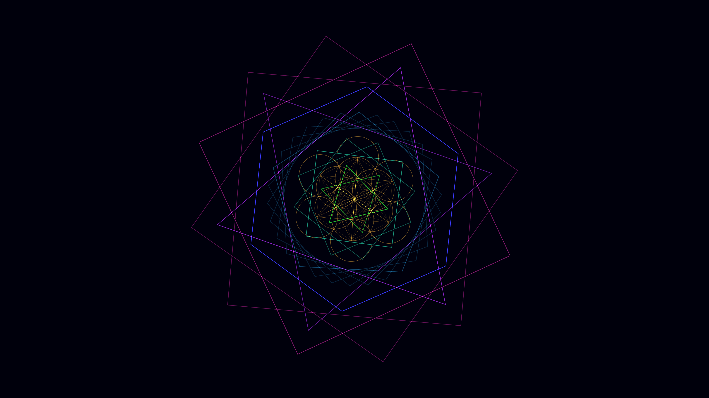

# sacred_geometry_metatron_cube_kaleidoscope_2d

## Metadata
- **Date**: 2026-06-14
- **Theme**: An animated 20s sequence of a golden, glowing Metatron's Cube that slowly rotates while a kaleidosco
- **Technique**: 2D drawing with intense additive blending. Metatron's cube is drawn procedurally (13 circles connected by lines). The kaleidoscope effect is created with `py5.push_matrix`, `py5.rotate`, and `py5.scale` in a nested loop to duplicate geometric polygons into radial symmetry.
- **Logic Lab Reference**: 

## Concept
An animated 20s sequence of a golden, glowing Metatron's Cube that slowly rotates while a kaleidoscope of sacred geometry patterns unfolds and morphs around it in deep space.

## Technical Details
- **Renderer**: Unknown
- **Simulation**: Unknown
- **Visuals**: Unknown
- **Animation**: Unknown
