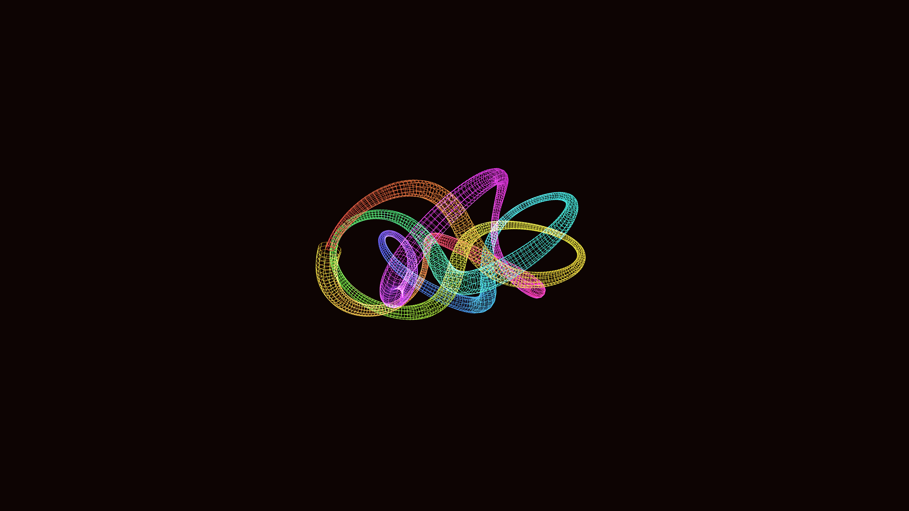

# sacred_geometry_torus_knot_wireframe_3d

## Metadata
- **Date**: 2026-05-28
- **Theme**: - **Date**: 2026-05-28 - **Theme**: A mathematical representation of a sacred geometry torus knot re
- **Technique**: Unknown
- **Logic Lab Reference**: 

## Concept
- **Date**: 2026-05-28
- **Theme**: A mathematical representation of a sacred geometry torus knot rendered as an intricate, glowing 3D wireframe that rotates and twists dynamically.
- **Technique**: Procedurally generated using parametric equations for a torus knot (p=3, q=7). Calculates a Frenet frame for the path to extrude a custom 3D tube wireframe. Uses additive blending and dynamic lighting.
- **Description**: An animated 3D wireframe of a sacred geometry torus knot.

## Technical Details
- **Renderer**: Unknown
- **Simulation**: Unknown
- **Visuals**: Unknown
- **Animation**: Unknown
