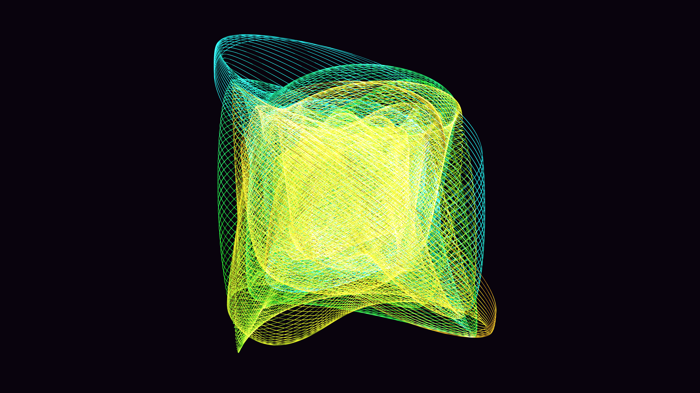

# sacred_harmonograph_mandala_3d

## Metadata
- **Date**: 2026-05-31
- **Theme**: Generative Art
- **Technique**: Generating 150 complex parametric 3D curves using harmonograph/spirograph trigonometric equations. The phase of each curve is modulated by its index and a global time phase, ensuring a perfect 10-second loop. The 150 curves overlap with additive blending to create intense, neon intersections.
- **Logic Lab Reference**: 

## Concept
No concept description provided.

## Technical Details
- **Renderer**: Unknown
- **Simulation**: Unknown
- **Visuals**: Unknown
- **Animation**: Contains animation details
