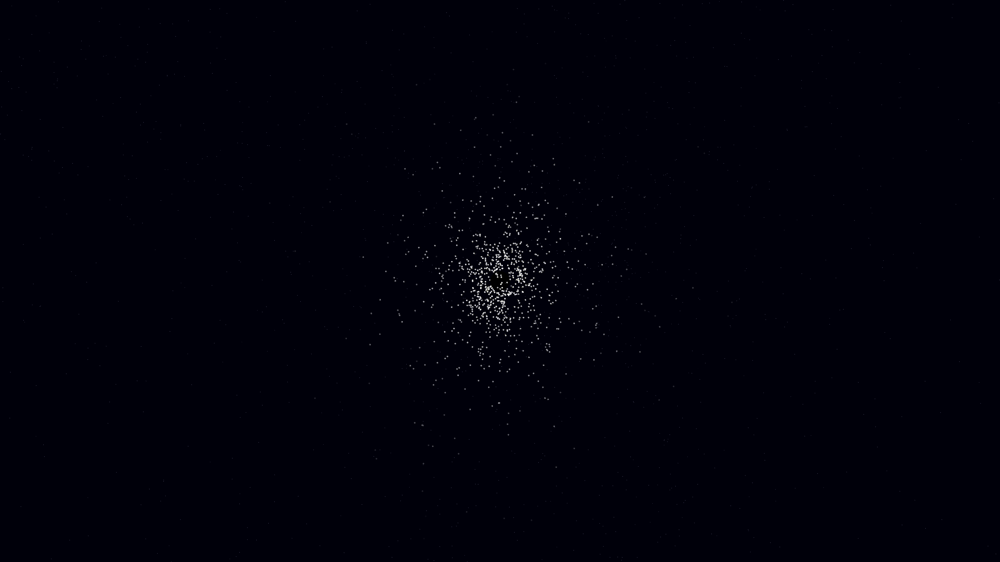

# sagittarius_a_orbits

- **Date**: 2026-05-06
- **Theme**: Galactic center, orbital dynamics, relativistic speeds, beautiful night sky
- **Technique**: 3D orbital simulation of 1,000 "S-stars" using Keplerian dynamics around a central singularity. Stars follow highly elliptical orbits, stretching into silken spectral trails as they reach relativistic speeds near periapsis. Features a multi-pass additive rendering for the star cluster and a dense background galactic starfield. 60fps high-bitrate MP4.
- **Description**: A high-energy visualization of the heart of our galaxy; 1,000 stars dance in a chaotic yet majestic orbital web around the invisible supermassive black hole Sagittarius A*, their paths tracing glowing filaments of white and gold light against a deep indigo void.

