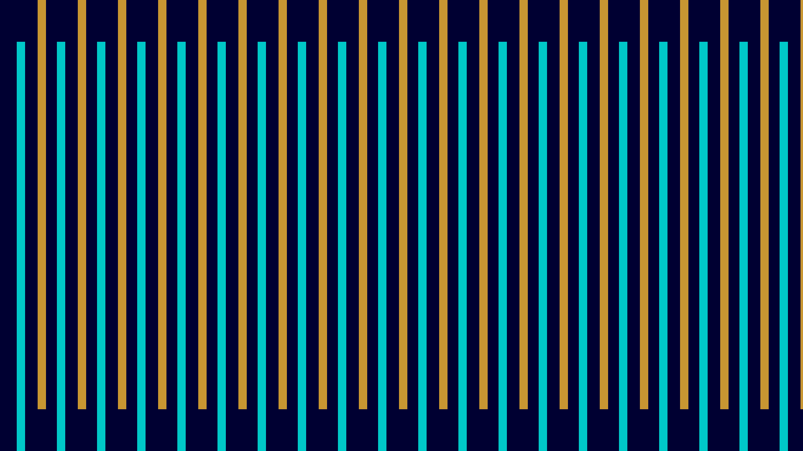

# salt_finger_convection_sim

**Theme**: Double-diffusive convection where warm, salty water lies over cold, fresh water, creating intricate falling salt fingers and rising thermal plumes due to differing diffusion rates.
**Technique**: Vectorized 2D Boussinesq Navier-Stokes with two coupled advection-diffusion scalar fields.
**Format**: Animation (15s @ 60fps)

## Output

*A video animation (salt_finger_convection_sim.mp4) is also generated during execution.*
