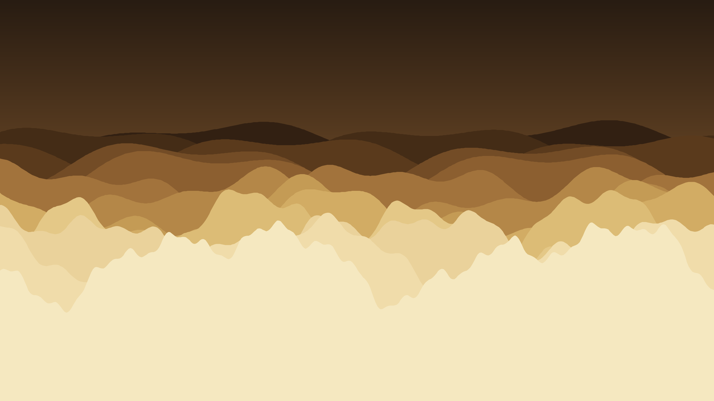

# sand_dunes

## Metadata
- **Date**: 2026-04-26
- **Theme**: desert landscape, geology, atmosphere, light.
- **Technique**: layered ridge silhouettes back-to-front, 1D cosine noise profiles (2–5 octaves), filled polygon depth compositing, sky gradient via numpy pixel buffer.
- **Logic Lab Reference**: None

## Concept
14 dune ridge silhouettes progress from dark brown near the horizon to pale ivory cream in the foreground, with a burnt-sienna-to-amber sky gradient; front layers have higher octave noise and greater amplitude, producing sharp desert crests while back layers dissolve into hazy distance.

## Technical Details
- **Renderer**: P2D
- **Simulation**: NumPy.
- **Visuals**: pixel-buffer rendering, bloom-like highlights, dark-field contrast.
- **Animation**: Still image
