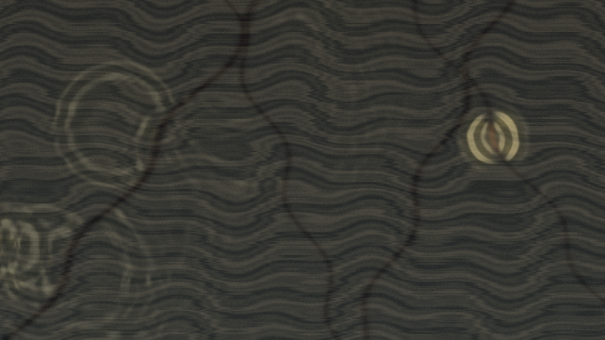

# seismic_lithograph

## Metadata
- **Date**: 2026-05-10
- **Theme**: low seismic pulses traveling through an etched stone slab, revealing hidden layers and quiet fault heat.
- **Technique**: 2D finite-difference wave field on a layer-dependent stiffness map. Stratified shale bands are synthesized as a lithographic base texture; diagonal fault masks add nonlinear slip and localized heat memory. Signed wave height, accumulated strain, and fault heat are mapped to slate, ash, sulfur, and rust tones through direct py5 pixel-buffer rendering. 10s 4K/60fps MP4.
- **Logic Lab Reference**: None

## Concept
A dark mineral surface where slow pressure waves cross layered stone, briefly exposing pale stress contours and rust-colored fault scars before the slab returns to a quiet, smoky lithographic texture.

## Technical Details
- **Renderer**: P2D
- **Simulation**: 2D finite-difference wave field on a layer-dependent stiffness map.
- **Visuals**: pixel-buffer rendering, bloom-like highlights, dark-field contrast.
- **Animation**: 10 seconds at 60fps
