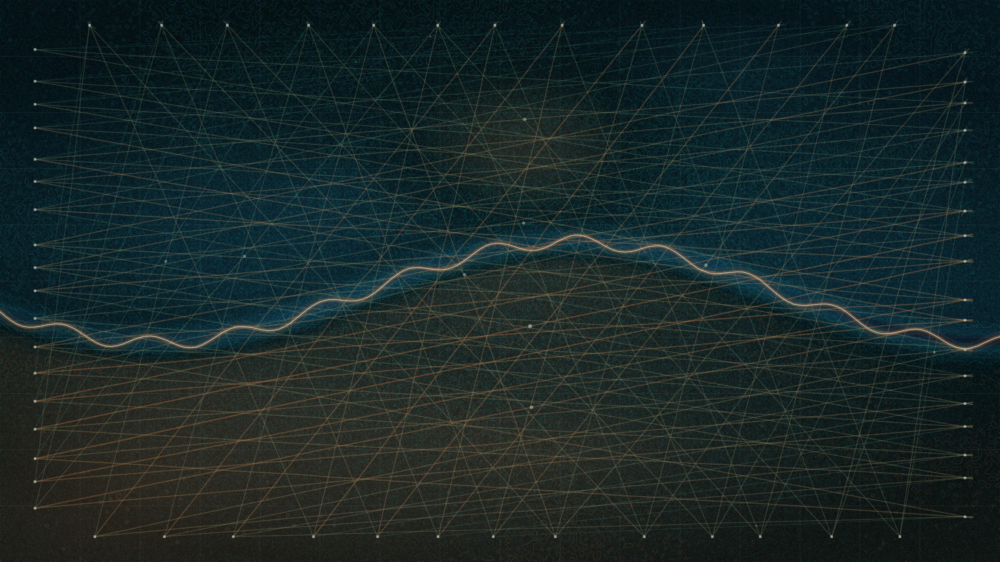

# seismic_tomography

## Metadata
- **Date**: 2026-05-04
- **Theme**: Hidden pressure beneath a surface, measurement, fault memory, geophysical abstraction.
- **Technique**: Synthetic seismic velocity-field synthesis, refracted ray tracing, travel-time residual coloring, marching-squares contour extraction, Retina-aware pixel-buffer compositing.
- **Logic Lab Reference**: None

## Concept
A dark subsurface instrument plate is crossed by muted teal and copper ray fans from edge sensors; faint residual contours and a chalk-copper fault trace reveal buried pressure without turning the scene into a literal landscape.

## Technical Details
- **Renderer**: P2D
- **Simulation**: Synthetic seismic velocity-field synthesis, refracted ray tracing, travel-time residual coloring, marching-squares contour extraction, Retin.
- **Visuals**: pixel-buffer rendering, dark-field contrast.
- **Animation**: Animation
