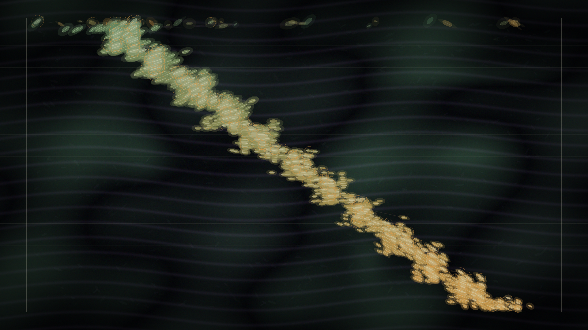

# selection_pressure

## Metadata
- **Date**: 2026-05-04
- **Theme**: Environmental pressure, adaptation, inherited variation, survival memory.
- **Technique**: Genetic-algorithm inspired population simulation, selection-weighted reproduction, phenotype mutation, lineage trail rendering, Retina-aware pixel-buffer habitat compositing.
- **Logic Lab Reference**: None

## Concept
A dark habitat field records generations of small abstract phenotypes drifting diagonally through selection pressure; pale moss bodies, muted amber elite rings, and faint extinct variants reveal a population slowly changing shape to survive.

## Technical Details
- **Renderer**: P2D
- **Simulation**: Genetic-algorithm inspired population simulation, selection-weighted reproduction, phenotype mutation, lineage trail rendering, Retina-aware.
- **Visuals**: pixel-buffer rendering, persistent trails, bloom-like highlights, dark-field contrast.
- **Animation**: Animation
