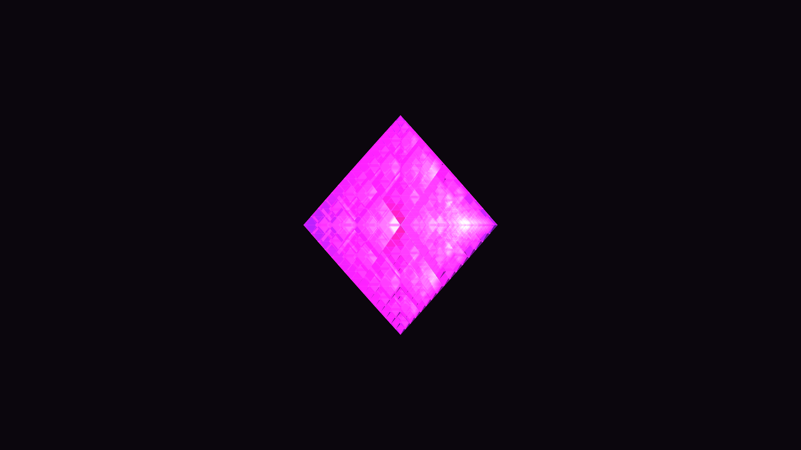

# sierpinski_octahedron_crystal_fractal_3d

## Metadata
- **Date**: 2026-05-31
- **Theme**: Generative Art
- **Technique**: Generating a 3D fractal structure through a 5-level recursive function. This creates 7,776 individual translucent octahedrons in 3D space. The global time phase elegantly drives the rotation, as well as a "breathing" sine wave function that pushes the vertices of the fractal outward slightly, making the crystal look as though it's alive and continuously oscillating.
- **Logic Lab Reference**: 

## Concept
No concept description provided.

## Technical Details
- **Renderer**: Unknown
- **Simulation**: Unknown
- **Visuals**: Unknown
- **Animation**: Contains animation details
