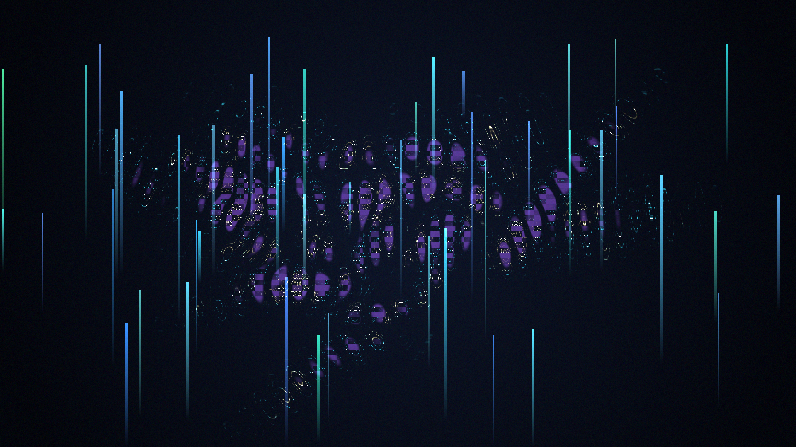

# signal_fossil

## Metadata
- **Date**: 2026-05-03
- **Theme**: digital archaeology, damaged broadcast, memory, modern abstraction
- **Technique**: Gabor-like wave packet synthesis, contour quantization, packet dropout masking, additive multi-hue glow

## Concept
A damaged future signal appears as a luminous fossil excavated from a near-black technological substrate; cyan contour shards, amber stress edges, violet missing-data shadows, and vertical recovery ticks form a full-canvas abstract relic of compressed light.

## Technical Details
- **Renderer**: P2D
- **Simulation**: Gabor-like wave packet synthesis
- **Visuals**: contour quantization, packet dropout masking, additive multi-hue glow
