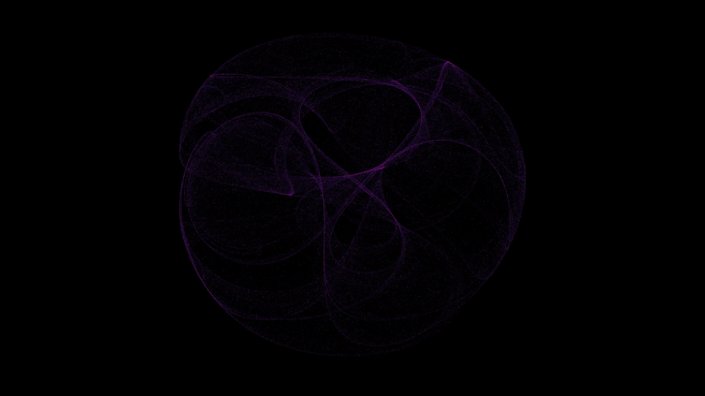

# silken_clifford_attractor

Silken veils of mathematical smoke folding through higher dimensions, capturing the ghostly signature of a chaotic strange attractor.

## Details

- **Date**: 2026-05-30
- **Theme**: Silken veils of mathematical smoke folding through higher dimensions, capturing the ghostly signature of a chaotic strange attractor.
- **Technique**: Animated Clifford Attractor. Millions of chaotic orbits are accumulated per frame into a high-dynamic-range density buffer, which is tone-mapped to colors. Parameters smoothly drift over time.
- **Palette**: Pitch black background, deep violet/indigo, crimson/magenta, blinding golden white.

## Previews



## Usage

```bash
uv run python main.py
```
