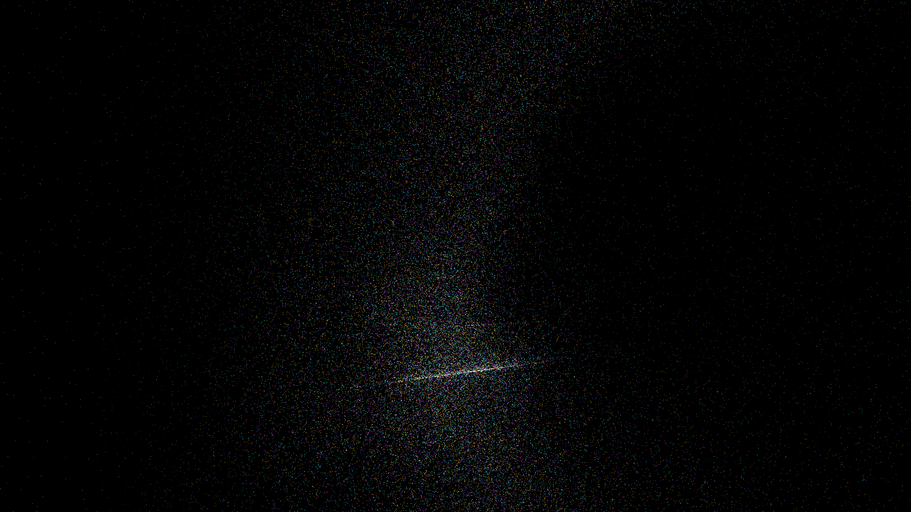

# singularity_braiding

## Metadata
- **Date**: 2026-05-07
- **Theme**: Quantum field topology, cosmic strings, topological defects, beautiful night sky.
- **Technique**: 3D particle simulation (150,000 particles) advected along the gradient of a dynamic complex potential field. Multi-pass additive rendering with HSB spectral mapping (Cyan/Amethyst/Gold) and a high-density starfield (12,000 stars). 60fps high-bitrate MP4.
- **Logic Lab Reference**: None

## Concept
A majestic vision of cosmic topological defects; silken threads of electric cyan and royal amethyst light braid and twist around invisible singularities, creating an intricate tapestry of quantum energy against the deep obsidian night.

## Technical Details
- **Renderer**: P3D
- **Simulation**: particle, 3D particle.
- **Visuals**: additive blending, HSB spectral mapping, bloom-like highlights, prismatic color, dark-field contrast.
- **Animation**: 10 seconds at 60fps
