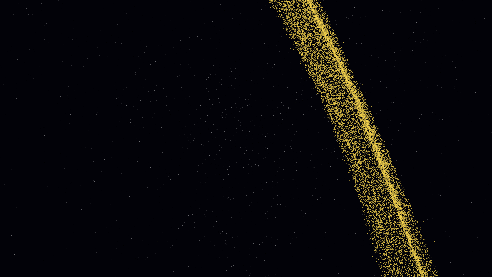

# skyrmion_vortex_lattice

## Metadata
- **Date**: 2026-05-09
- **Theme**: Skyrmions, magnetic topology, spin textures, beautiful night sky.
- **Technique**: 3D simulation of 150,000 "spin tracer" particles advected by a lattice of 9 Skyrmion cores. Implements a multi-pole vortex field with topological twisting and core oscillations. Multi-pass additive rendering with an "Emerald Glow / Burnished Gold / Deep Ultraviolet" palette. 60fps high-bitrate MP4.
- **Logic Lab Reference**: None

## Concept
A majestic visualization of a magnetic Skyrmion lattice; swirling vortices of emerald and gold light wrap around stable topological cores, weaving an intricate web of silken spin textures against the deep violet star-dusted night.

## Technical Details
- **Renderer**: P3D
- **Simulation**: particle.
- **Visuals**: additive blending, bloom-like highlights, dark-field contrast.
- **Animation**: 10 seconds at 60fps
