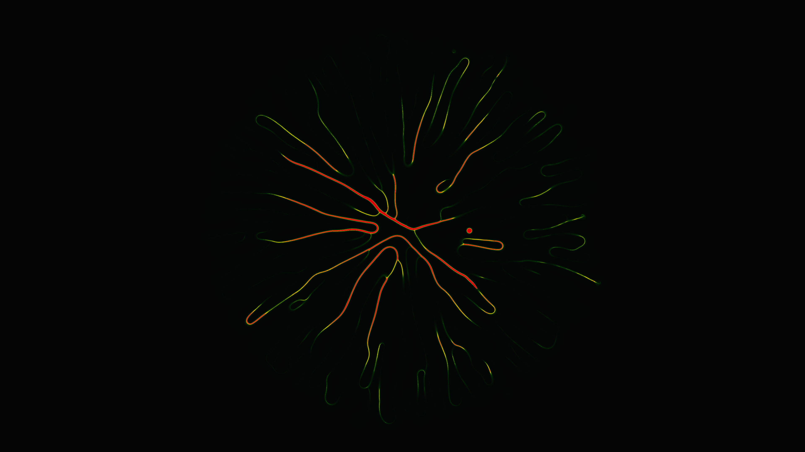

# slime_intelligence

An exploration of decentralized biological intelligence through a Physarum polycephalum (slime mold) transport network simulation.

## Concept

This artwork simulates the foraging behavior of a collective organism. Thousands of autonomous agents navigate a digital environment, depositing pheromones and following the gradients left by others. Over time, these simple rules produce a complex, self-organizing network that optimizes for efficient connectivity, mimicking the natural intelligence of slime molds used in biological computation.

## Technique

- **Physarum Simulation**: 100,000 agents with sensor-based navigation.
- **Agent Behavior**: Three-way sensing (left, center, right), trail deposition, and gradient-following rotation.
- **Environment Dynamics**: Trail map diffusion via Gaussian filter and exponential decay to simulate evaporating pheromones.
- **Rendering**: Custom color mapping from trail density to a bioluminescent palette (Indigo, Teal, and Gold).
- **Implementation**: Vectorized NumPy for high-performance agent physics and Scipy for spatial diffusion.

## Data

- **Date**: 2026-05-02
- **Theme**: Nature, Biology, Emergent Intelligence, Biological Networks
- **Technique**: Agent-based Physarum simulation, Trail map diffusion
- **Format**: 10s Animation @ 60fps (MP4)
