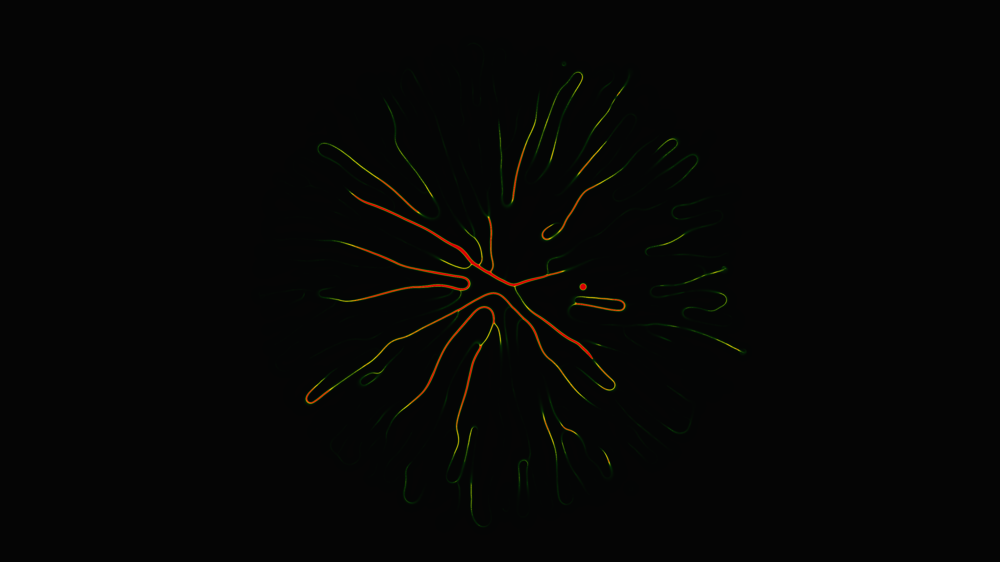

# slime_intelligence

## Metadata
- **Date**: 2026-05-02
- **Theme**: nature, biology, emergent intelligence, biological networks.
- **Technique**: agent-based Physarum simulation, trail map diffusion, vectorized NumPy physics.
- **Logic Lab Reference**: None

## Concept
100k autonomous agents simulate the foraging behavior of a slime mold, self-organizing into an organic transport network with bioluminescent indigo, teal, and gold trails against a deep obsidian void.

## Technical Details
- **Renderer**: P2D
- **Simulation**: Vectorized NumPy, NumPy.
- **Visuals**: persistent trails.
- **Animation**: 10 seconds at 60fps
