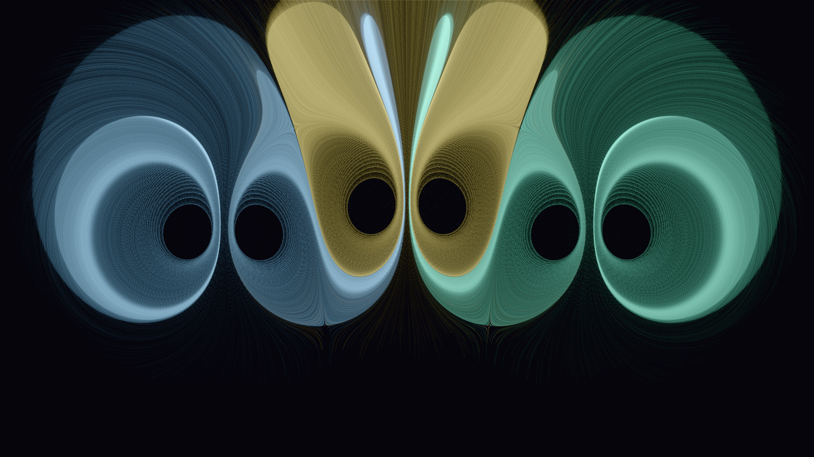

# smoke_rings

## Metadata
- **Date**: 2026-04-26
- **Theme**: fluid dynamics, vortex rings, physics, atmospheric.
- **Technique**: point vortex Biot-Savart simulation, 50k particles per ring, bincount density accumulation, log tone mapping.
- **Logic Lab Reference**: None

## Concept
Three vortex ring cross-sections (cerulean · gold · mint) formed by counter-rotating point vortex pairs; 50k particles per ring trace the toroidal Biot-Savart flow field for 200 steps; density accumulation reveals tight glowing cores and diffuse return-flow halos against near-black.

## Technical Details
- **Renderer**: P2D
- **Simulation**: particle.
- **Visuals**: bloom-like highlights, dark-field contrast.
- **Animation**: Still image
