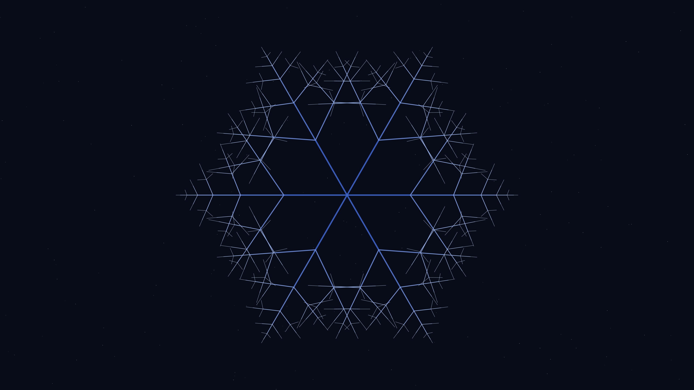

# snowflake_crystal

## Metadata
- **Date**: 2026-04-26
- **Theme**: nature, crystallography, winter, 6-fold symmetry, fractal.
- **Technique**: recursive depth-7 branching with per-depth random parameters (decay, angle, branch fraction) applied identically to all 6 arms; depth-based color interpolation blue→white; stroke weight tapering.
- **Logic Lab Reference**: None

## Concept
A unique hexagonal snow crystal each run; six recursive fractal arms with randomized branching angles and decay ratios produce dendritic plate and stellar-dendrite morphologies against a midnight-sky star field.

## Technical Details
- **Renderer**: P2D
- **Simulation**: recursive.
- **Visuals**: HSB spectral mapping, bloom-like highlights, prismatic color, dark-field contrast.
- **Animation**: Still image
