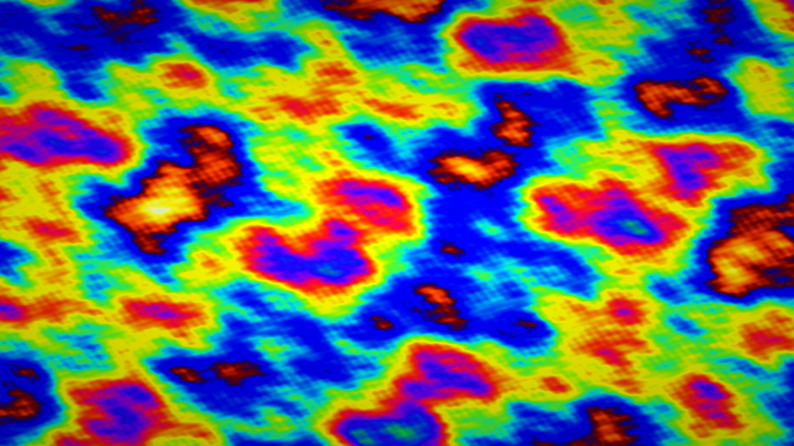

# soap_film

## Metadata
- **Date**: 2026-04-26
- **Theme**: optics, thin-film interference, iridescence, light, physics.
- **Technique**: 6-octave fBm thickness field (0–680 nm), 21-wavelength spectral integration of I(λ)=½(1−cos(4πnt/λ)) with CIE sensitivity curves, saturation boost + power-law tone map.
- **Logic Lab Reference**: None

## Concept
A soap film's iridescent colour field rendered from first-principles thin-film optics; Newton's interference colour sequence (black film → first-order violet/blue → green → orange/red → second-order) swirls across an fBm thickness landscape, gravity-biased thicker at the bottom.

## Technical Details
- **Renderer**: P2D
- **Simulation**: 6-octave fBm thickness field (0–680 nm), 21-wavelength spectral integration of I(λ)=½(1−cos(4πnt/λ)) with CIE sensitivity curves, saturation.
- **Visuals**: HSB spectral mapping, prismatic color, dark-field contrast.
- **Animation**: Still image
