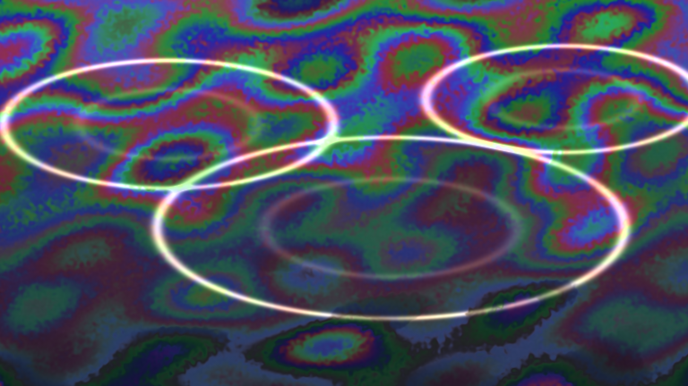

# soap_film_thickness_flow

## Metadata
- **Date**: 2026-05-10
- **Theme**: draining soap film where nanoscale thickness changes become moving interference colors and pale bubble rims.
- **Technique**: Procedural thin-film thickness field driven by vertical drainage, shear waves, circular bubble boundaries, and dry black-film memory. Spectral cosine interference maps thickness to saturated green, blue, violet, and magenta bands, with bright pearl rim highlights and slow rupture shadows rendered directly through the py5 pixel buffer. 10s 4K/60fps MP4, generated as `output.mp4` and mirrored to `soap_film_thickness_flow.mp4`.
- **Logic Lab Reference**: None

## Concept
Large bright arcs cut through a flowing field of iridescent color bands, suggesting a fragile soap membrane draining, thinning, and remembering near-rupture zones.

## Technical Details
- **Renderer**: P2D
- **Simulation**: Procedural thin-film thickness field driven by vertical drainage, shear waves, circular bubble boundaries, and dry black-film memory.
- **Visuals**: HSB spectral mapping, pixel-buffer rendering, prismatic color, dark-field contrast.
- **Animation**: 10 seconds at 60fps
