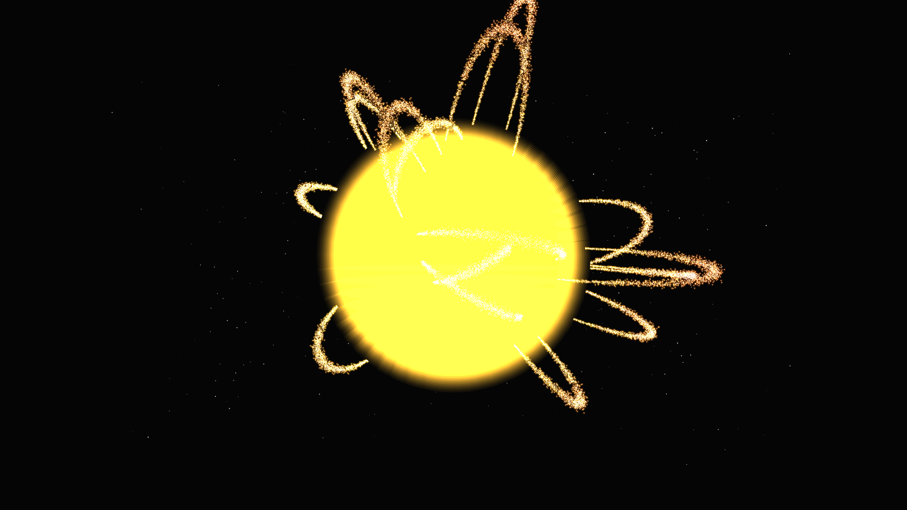

# solar_flare_loops

## Metadata
- **Date**: 2026-05-05
- **Theme**: Solar flare loops, magnetic arcs, plasma dynamics, beautiful night sky.
- **Technique**: 3D magnetic loop simulation using 24 dynamic Bezier curves and 48,000 particles with volumetric noise offsets. Multi-pass rendering for incandescent core glow and plasma filaments (core/halo), 60fps high-quality MP4 encoding.
- **Logic Lab Reference**: None

## Concept
A high-energy visualization of a star's surface; massive arcs of shimmering plasma rise and fall from the incandescent solar core, pulsing with rhythmic magnetic energy against the silent obsidian void.

## Technical Details
- **Renderer**: P3D
- **Simulation**: particle.
- **Visuals**: bloom-like highlights, dark-field contrast.
- **Animation**: 10 seconds at 60fps
