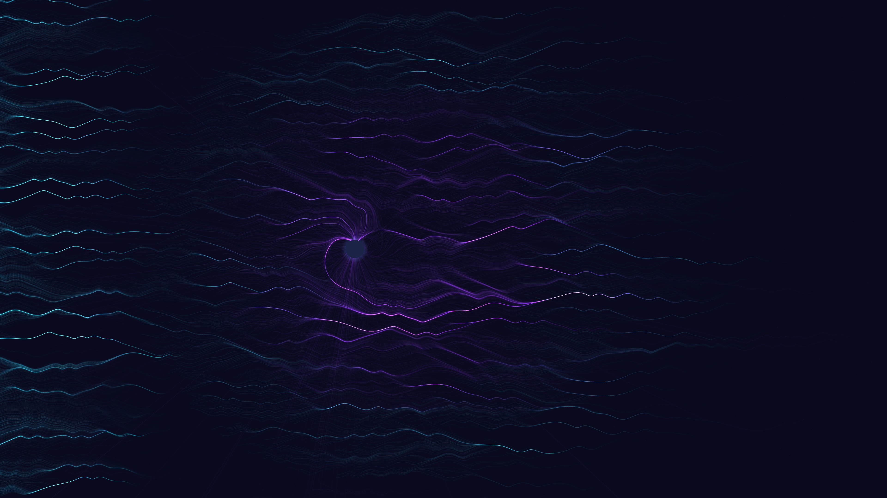

# solar_wind

## Metadata
- **Date**: 2026-05-02
- **Theme**: plasma, magnetic fields, solar activity, cosmic energy.
- **Technique**: magnetic dipole streamline integration, particle systems, additive blending, cosmic noise background.
- **Logic Lab Reference**: None

## Concept
High-energy plasma ribbons of cyan and violet being deflected and channeled by a planetary magnetic field against a star-dusted void.

## Technical Details
- **Renderer**: P2D
- **Simulation**: particle.
- **Visuals**: additive blending, HSB spectral mapping, bloom-like highlights, prismatic color, dark-field contrast.
- **Animation**: Animation
