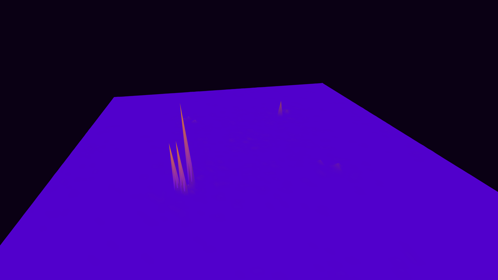

# soliton_resonance_void

## Metadata
- **Date**: 2026-05-13
- **Theme**: Nonlinear Schrödinger Equation (NLSE), solitons, breather modes, wave interference.
- **Technique**: 2D NLSE simulation on a 256x256 grid using the Split-Step Fourier Method. Visualizes the evolution and collision of multiple localized wave packets (solitons) in a focusing nonlinear medium. 15s 4K/60fps MP4.
- **Logic Lab Reference**: None

## Concept
A dark, tranquil pool of violet energy where bright, localized pulses of rose and gold light emerge, collide, and pass through each other with intense, flickering resonance, demonstrating the unique stability and interaction of solitons.

## Technical Details
- **Renderer**: P3D
- **Simulation**: Split-Step.
- **Visuals**: layered py5 drawing.
- **Animation**: 15 seconds at 60fps
