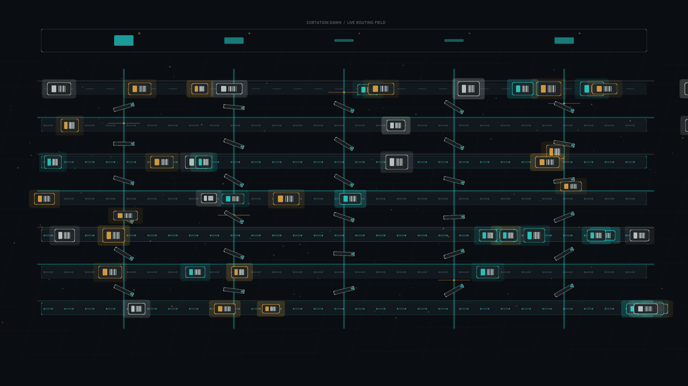

# sortation_dawn

## Metadata
- **Date**: 2026-05-19
- **Theme**: A modern logistics floor waking before sunrise, where silent machines route parcels with choreographed precision.
- **Technique**: Event-driven conveyor network animation with easing-based lane transfers, rotating diverter gates, scanner sweeps, restrained additive glow, and procedural parcel traffic.
- **Logic Lab Reference**: None

## Concept
`sortation_dawn` treats a warehouse sortation system as a nocturnal city grid: parcels glide like commuter lights, gates pivot in waves, and barcode scanners sweep the lanes with a cold cyan pulse. The modern twist is intentionally utilitarian rather than decorative, turning logistics infrastructure into a precise night-sky choreography of motion, routing, and signal.

## Technical Details
- **Renderer**: P2D
- **Simulation**: Procedural discrete routing network with stochastic parcel generation and easing-based lane transitions
- **Visuals**: Graphite industrial floor, cyan scanner beams, amber status lights, silver parcel labels, soft glow passes
- **Animation**: 10 seconds at 60fps, generating `output.mp4` and `sortation_dawn_p1.png`
