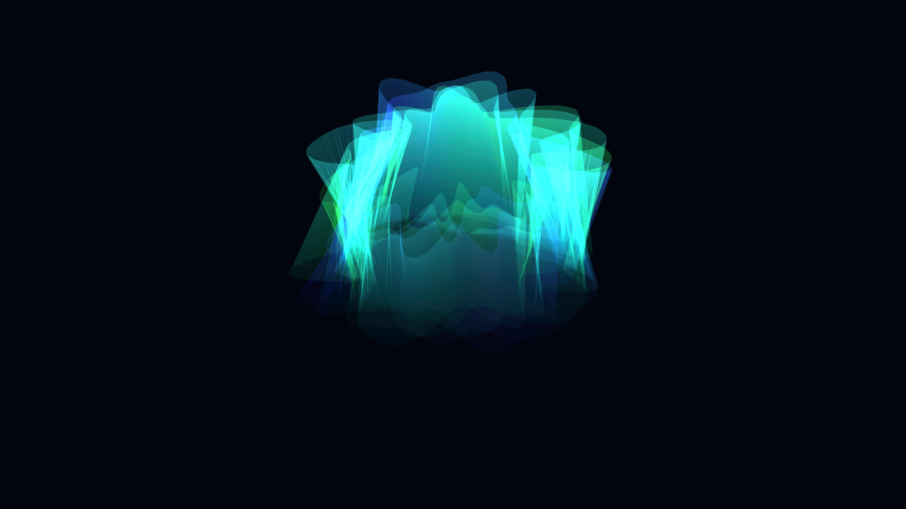

# spectral_aurora_borealis_ribbons_3d

## Metadata
- **Date**: 2026-06-07
- **Theme**: An ethereal 3D simulation of the Aurora Borealis, consisting of sheer, glowing vertical ribbons of l
- **Technique**: 3D `QUAD_STRIP` curtains displaced by 4D OpenSimplex noise. Colors shift smoothly between emerald green, neon violet, and magenta using HSB mapping. Additive blending gives the ethereal glow.
- **Logic Lab Reference**: 

## Concept
An ethereal 3D simulation of the Aurora Borealis, consisting of sheer, glowing vertical ribbons of light that undulate organically in the polar sky.

## Technical Details
- **Renderer**: Unknown
- **Simulation**: Unknown
- **Visuals**: Unknown
- **Animation**: Unknown
