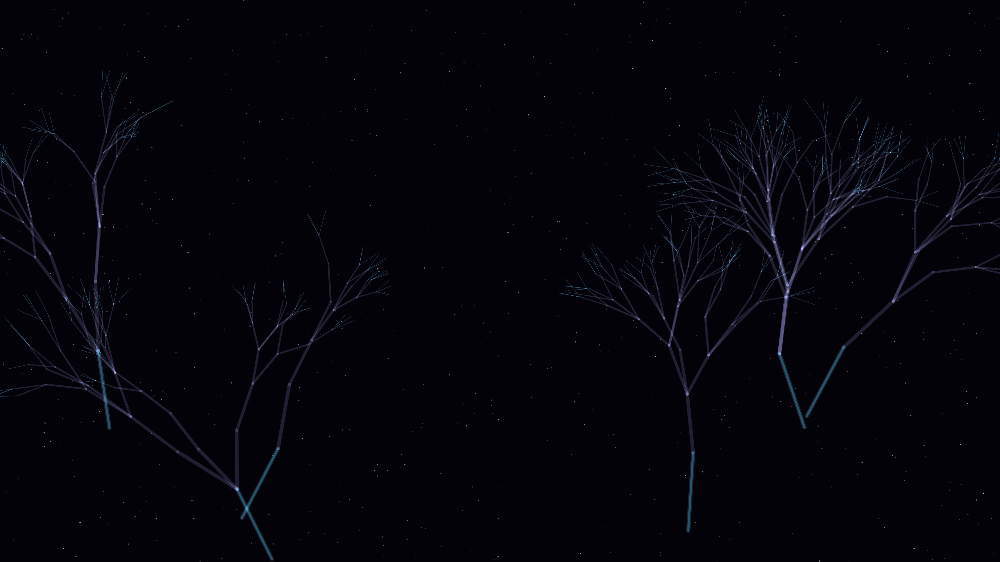

# spectral_coral

## Metadata
- **Date**: 2026-05-05
- **Theme**: Synthetic marine life, metabolic light, crystalline coral, beautiful night sky
- **Technique**: Stochastic branching growth, metabolic spectral pulse modulation, recursive fractal geometry, additive bloom rendering

## Concept
An intricate visualization of "spectral coral" structures that grow and pulse in a dark void; the crystalline branches in slate and graphite shimmer with rhythmic pulses of electric cyan, cyber lime, and amethyst against a star-dusted night sky.

## Technical Details
- **Renderer**: P2D
- **Simulation**: Stochastic branching growth
- **Visuals**: metabolic spectral pulse modulation, recursive fractal geometry, additive bloom rendering
- **Animation**: 10s @ 60fps (typical)
