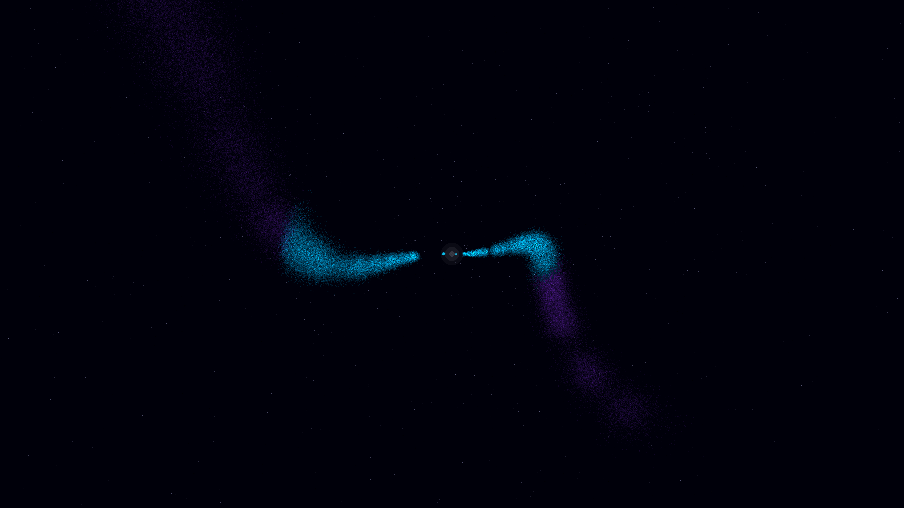

# spectral_jet_precession

- **Date**: 2026-05-06
- **Theme**: Relativistic jet, pulsar precession, helical flow, beautiful night sky
- **Technique**: 3D simulation of a precessing bipolar relativistic jet using a recycling particle system (200,000 particles). Features time-modulated axial rotation that carves majestic helical "corkscrew" paths in the intergalactic medium. Multi-pass additive rendering with a spectral Teal/Violet palette, a high-intensity flickering core, and a high-density background starfield. 60fps high-bitrate MP4.
- **Description**: A majestic vision of a pulsar beacon; two silken beams of light twist through the intergalactic void in a beautiful, geometric corkscrew pattern, pulsing with spectral energy against the deep obsidian night.

