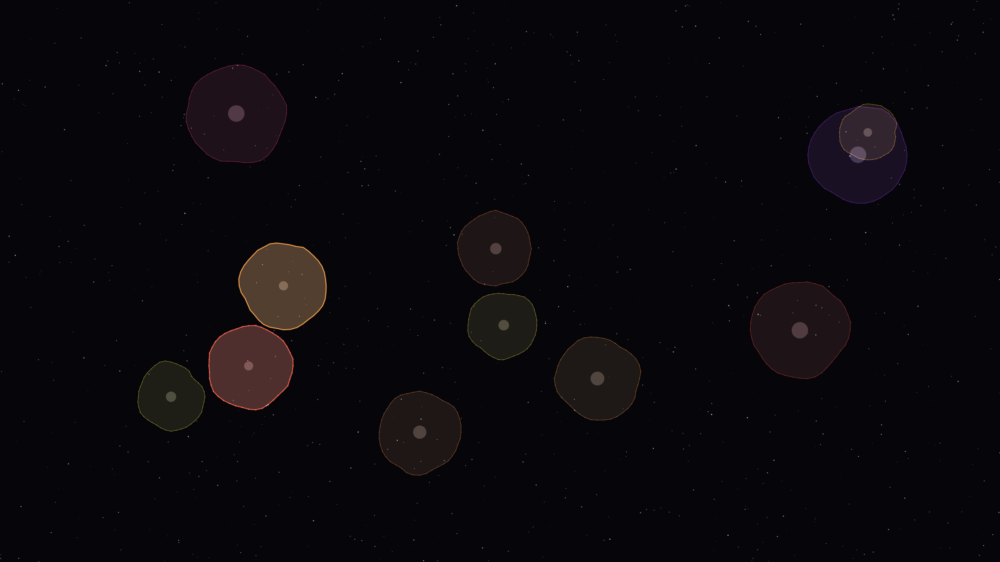

# spectral_mitosis

## Metadata
- **Date**: 2026-05-05
- **Theme**: Synthetic biology, membrane dynamics, information splitting, beautiful night sky.
- **Technique**: Stochastic cell simulation (P2D), iridescent membrane oscillation, spectral mitosis bursts, high-density starfield rendering.
- **Logic Lab Reference**: None

## Concept
An intricate visualization of synthetic biological growth where glowing organic forms in electric cyan and cyber magenta pulse and divide in a deep void; the shimmering celestial tapestry of mitosis events pulses with a rhythmic harmony against a star-dusted midnight sky.

## Technical Details
- **Renderer**: P2D
- **Simulation**: Stochastic cell simulation (P2D), iridescent membrane oscillation, spectral mitosis bursts, high-density starfield rendering.
- **Visuals**: HSB spectral mapping, prismatic color, dark-field contrast.
- **Animation**: 10 seconds at 60fps
