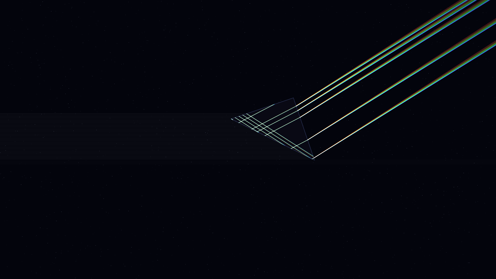

# spectral_prism

A rotating obsidian prism refracts white starlight into a rainbow fan.

## Description

This work simulates the optical physics of chromatic dispersion. A central, rotating obsidian prism catches a beam of intense white starlight and refracts it into a shimmering, fluid fan of spectral colors. Using Snell's Law and Cauchy's dispersion equation, the light is split into 12 distinct wavelength bands that sweep across the canvas like a celestial lighthouse beam against a deep star-dusted void.

## Details

- **Date**: 2026-05-05
- **Theme**: Optical physics, chromatic dispersion, liquid light, beautiful night sky
- **Technique**: 
  - Physical Snell's Law refraction logic
  - Cauchy's dispersion equation for refractive index modulation
  - Multi-pass ray tracing (12 wavelength bands)
  - HSB-spectral coloring
  - P2D additive blending for luminous light fans
  - Dense twinkling starfield
- **Output**: 10s animation @ 60fps (3840x2160)

## Preview

## Animation

[output.mp4](output.mp4)
