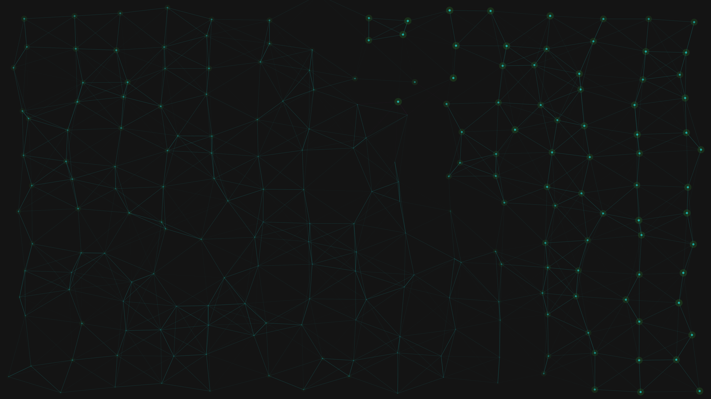

# spectral_synchrony

## Metadata
- **Date**: 2026-05-03
- **Theme**: mathematics, synchronization, emergence, networks, resonance.
- **Technique**: Kuramoto model simulation, coherence-based edge rendering, phase-mapped pulsing, additive SCREEN blending.
- **Logic Lab Reference**: None

## Concept
200 coupled oscillators self-organize from chaos into a rhythmic collective heartbeat; electric cyan and deep magenta connections emerge as neighbors synchronize their internal phases, forming a breathing web of light against deep charcoal.

## Technical Details
- **Renderer**: P2D
- **Simulation**: Kuramoto model simulation, coherence-based edge rendering, phase-mapped pulsing, additive SCREEN blending.
- **Visuals**: additive blending, HSB spectral mapping, prismatic color, dark-field contrast.
- **Animation**: 10 seconds at 60fps
