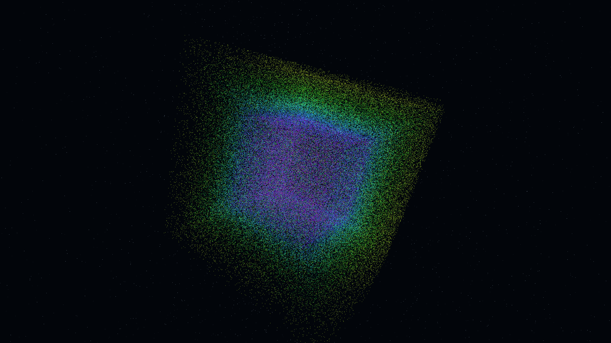

# spectral_tesseract_unfolding

## Metadata
- **Date**: 2026-05-08
- **Theme**: Higher dimensions, tesseract rotation, projection, mathematical beauty, beautiful night sky.
- **Technique**: 4D rotation and 3D perspective projection of a hypercube. 200,000 particles sampled from the 4D face-cells of a tesseract are rotated simultaneously in $xy$ and $zw$ planes. The 4D coordinates are projected into 3D space using a perspective transform $1/(d-w)$. Features multi-pass additive point rendering with an iridescent spectral palette (HSB shift from Indigo to Violet to Gold) and an integrated starfield. 60fps high-bitrate MP4.
- **Logic Lab Reference**: None

## Concept
A majestic, shimmering geometric structure of iridescent indigo and violet light turns and warps in the void, its higher-dimensional edges trailing golden sparks as it unfolds in ways that defy 3D logic against the star-dusted obsidian night.

## Technical Details
- **Renderer**: P3D
- **Simulation**: particle.
- **Visuals**: additive blending, HSB spectral mapping, prismatic color, dark-field contrast.
- **Animation**: 20 seconds at 60fps
