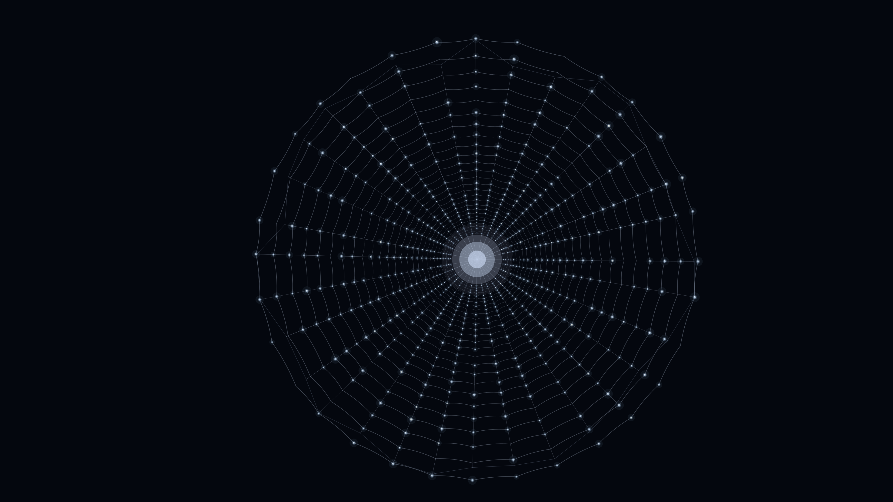

# spider_web

## Metadata
- **Date**: 2026-04-26
- **Theme**: nature, geometry, morning dew, organic structure, precision.
- **Technique**: logarithmic spiral row spacing, quadratic bezier sag per segment, 4-layer composited dew-drop circles with specular highlight, hub glow compositing, per-run randomised geometry.
- **Logic Lab Reference**: None

## Concept
Orb spider's web at dawn: 30–40 radial threads with angle jitter fan out to a frame polygon; 22–30 logarithmically spaced capture-silk spiral rows sag gently toward the hub via bezier; ~80% of intersections carry layered dew-drop pearls with white specular highlights against deep midnight blue.

## Technical Details
- **Renderer**: P2D
- **Simulation**: logarithmic spiral row spacing, quadratic bezier sag per segment, 4-layer composited dew-drop circles with specular highlight, hub glow comp.
- **Visuals**: bloom-like highlights, dark-field contrast.
- **Animation**: Still image
