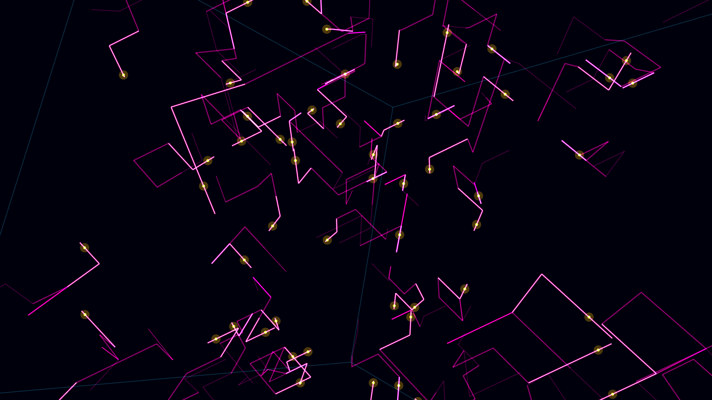

# spin_ice_monopoles

## Metadata
- **Date**: 2026-05-10
- **Theme**: Spin ice, geometrical frustration, emergent magnetic monopoles, crystal lattice defects.
- **Technique**: 3D simulation of a pyrochlore lattice (interlocking tetrahedra). Spins on the vertices are visualized as small glowing vectors. Thermal fluctuations flip spins, violating the "two-in, two-out" ground state and creating defect pairs (emergent magnetic monopoles). These monopoles drift through the lattice, connected by a shimmering "Dirac string" of flipped spins. Vectorized grid simulation with 80,000 particles.
- **Logic Lab Reference**: None

## Concept
A delicate, crystalline geometric grid in cold ice-blue stretches endlessly. Suddenly, bright golden sparks (monopoles) appear and wander through the structure, leaving behind glowing, jagged magenta trails (Dirac strings) that slowly fade, illustrating the hidden physics of frustrated magnetism.

## Technical Details
- **Renderer**: P3D
- **Simulation**: particle.
- **Visuals**: bloom-like highlights, dark-field contrast.
- **Animation**: 15 seconds at 60fps
