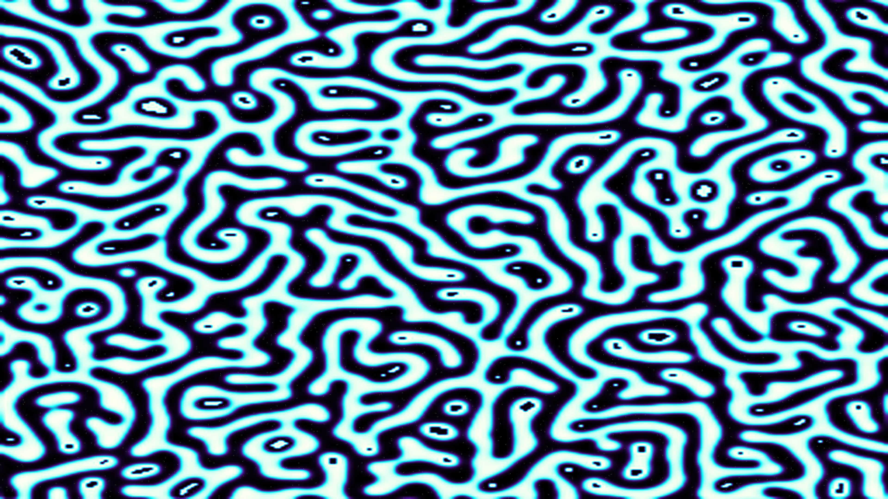

# spinodal_decomposition_nebula

## Metadata
- **Date**: 2026-05-13
- **Theme**: The spontaneous separation of two primordial fluids as the universe cools, creating a vast, intricate web of matter and void.
- **Technique**: Cahn-Hilliard equation simulation on a 256x256 grid, scaled to 4K using LANCZOS. Visualizes phase separation (spinodal decomposition) with a spectral mapping from obsidian to solar white. 15s 4K/60fps MP4.
- **Logic Lab Reference**: None

## Concept
A shimmering, uniform mist of purple and cyan slowly curdles and separates into a majestic, glowing sponge-like network of light threads, leaving vast dark voids in between.

## Technical Details
- **Renderer**: P2D
- **Simulation**: Cahn-Hilliard.
- **Visuals**: HSB spectral mapping, prismatic color, dark-field contrast.
- **Animation**: 15 seconds at 60fps
