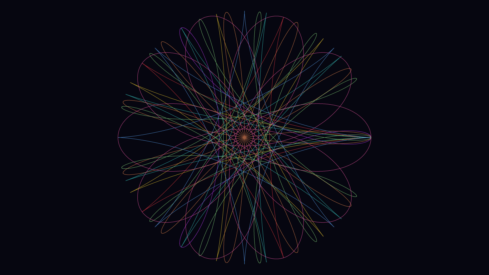

# spirograph

## Metadata
- **Date**: 2026-04-26
- **Theme**: mathematics, mechanical drawing, symmetry, petal geometry.
- **Technique**: parametric hypotrochoid equations (d = R−r rose mode), 8 overlaid curves with petal counts 4–12, normalized radii, semi-transparent concentric layering.
- **Logic Lab Reference**: None

## Concept
Eight hypotrochoid rose curves in distinct colors (crimson through rose) overlaid at the canvas center; petal counts 4, 5, 6, 7, 8, 9, 11, 12 build a stained-glass mandala where overlapping petals create color interference patterns.

## Technical Details
- **Renderer**: P2D
- **Simulation**: parametric hypotrochoid equations (d = R−r rose mode), 8 overlaid curves with petal counts 4–12, normalized radii, semi-transparent concentr.
- **Visuals**: HSB spectral mapping, prismatic color, dark-field contrast.
- **Animation**: Still image
