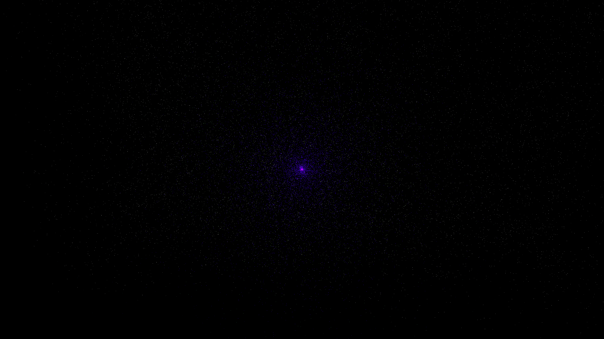

# star_cluster_core

## Metadata
- **Date**: 2026-05-07
- **Theme**: Globular cluster, stellar dynamics, core collapse, n-body simulation, beautiful night sky.
- **Technique**: 3D high-density stellar simulation featuring 3,000 dynamic "luminous" stars (using a vectorized central-potential gravity model) and 100,000 background "cloud" stars. Features multi-pass additive rendering with an "Ancient Stellar Core" HSB palette (Gold/Amber/White/Cyan). The central core is rendered with higher intensity and scale to simulate dynamical core collapse, set against a high-density starfield (12,000 stars). 60fps high-bitrate MP4.
- **Logic Lab Reference**: None

## Concept
A majestic, shimmering ball of thousands of stars that pulses with a golden intensity; at its heart, a dense sea of light swirls in a chaotic yet ordered orbital web against the deep obsidian night, representing the late-stage evolution of a dense globular cluster.

## Technical Details
- **Renderer**: P3D
- **Simulation**: 3D high-density stellar simulation featuring 3,000 dynamic "luminous" stars (using a vectorized central-potential gravity model) and 100,000.
- **Visuals**: additive blending, HSB spectral mapping, bloom-like highlights, prismatic color, dark-field contrast.
- **Animation**: 10 seconds at 60fps
