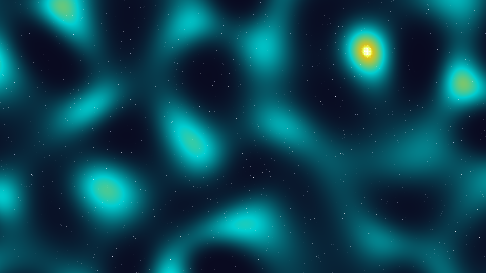

# Stellar Caustics

A visualization of light refracting through turbulent interstellar gas clouds.

## Concept
Interstellar gas is rarely uniform. As light from distant stars passes through these turbulent regions, it undergoes refraction, creating complex luminous networks known as caustics. This work simulates this phenomenon by superimposing multiple noise-distorted wave fields, creating a liquid-like tapestry of light.

## Technical Details
- **Multi-Wave Superposition**: 18 rotated plane waves are summed to create the base caustic field.
- **Turbulence Simulation**: The coordinate grid is distorted using a secondary set of low-frequency sine waves to simulate gaseous turbulence.
- **Non-linear Contrast Mapping**: A power-law mapping (γ=3.0) is applied to the field to sharpen the constructive interference peaks, mimicking the sharp focus of optical caustics.
- **Chromatic Glow**: Local maxima are identified and enhanced with additive solar flares and soft halos to simulate light diffusion.

## Aesthetics
- **Palette**: Midnight Indigo, Electric Teal, Solar Amber.
- **Mood**: Ethereal, liquid, and vast.
- **Visuals**: High-contrast luminous webs against a deep, starry background.
