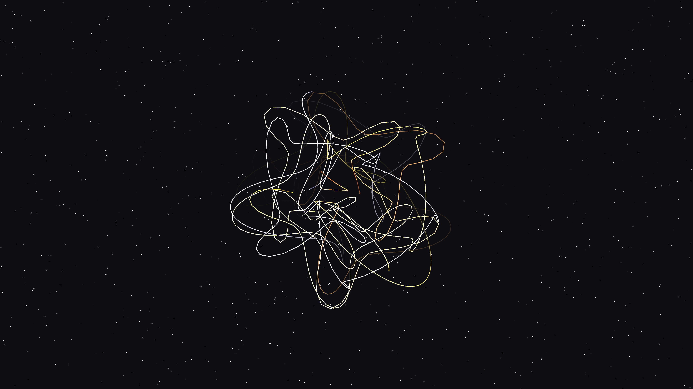

# stellar_clockwork

## Metadata
- **Date**: 2026-05-05
- **Theme**: Orbital resonance, astronomical instruments, temporal harmony, beautiful night sky.
- **Technique**: Nested epicyclic tracers (P2D), harmonic resonance tuning, high-persistence trace accumulation, spectral metal coloring (Gold/Silver/Copper).
- **Logic Lab Reference**: None

## Concept
An intricate visualization of celestial mechanics where nested golden and silver epicycles weave a complex, shimmering tapestry of orbital paths; the build-up of silken, thread-like textures pulses with a temporal harmony against a star-dusted midnight void.

## Technical Details
- **Renderer**: P2D
- **Simulation**: Nested epicyclic tracers (P2D), harmonic resonance tuning, high-persistence trace accumulation, spectral metal coloring (Gold/Silver/Copper).
- **Visuals**: HSB spectral mapping, bloom-like highlights, prismatic color, dark-field contrast.
- **Animation**: 10 seconds at 60fps
