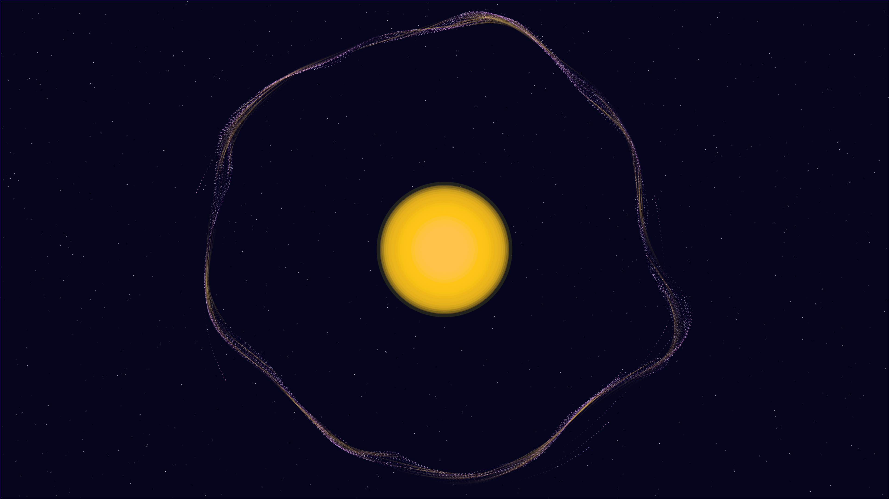

# stellar_equilibrium

## Metadata
- **Date**: 2026-05-04
- **Theme**: Cosmic energy, physical tension, solar majesty, beautiful night sky.
- **Technique**: N-body gravitational simulation, magnetic tension loops (Bezier), noise-driven solar core rendering, persistence-buffer trail accumulation.
- **Logic Lab Reference**: None

## Concept
A massive, pulsing star held in precarious balance between gravitational collapse and magnetic pressure; golden solar prominences surge from the core while violet plasma agents dance in complex orbits against a high-density star-dusted void.

## Technical Details
- **Renderer**: P2D
- **Simulation**: N-body gravitational simulation, magnetic tension loops (Bezier), noise-driven solar core rendering, persistence-buffer trail accumulation.
- **Visuals**: HSB spectral mapping, persistent trails, bloom-like highlights, prismatic color, dark-field contrast.
- **Animation**: Animation
