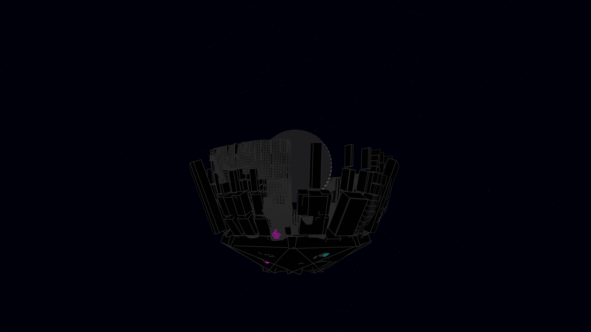

# stellar_megastructure

## Metadata
- **Date**: 2026-05-06
- **Theme**: Megastructures, stellar engineering, recursive architecture, beautiful night sky.
- **Technique**: 3D spherical quadtree subdivision mapped to (theta, phi) coordinates. Leaf nodes are rendered as obsidian boxes (`py5.box()`) with height modulation. Features a multi-pass central star core with additive bloom and a NumPy-vectorized starfield. Neon "data conduits" are rendered as additive lines on the slab surfaces. 60fps high-bitrate MP4.
- **Logic Lab Reference**: None

## Concept
A visualization of a Type II civilization's Dyson Shell in progress; a massive, dark, recursive geometric shell partially encloses a pulsing star, revealing the blinding white-gold energy of the core through its gaps against a silent, star-dusted night.

## Technical Details
- **Renderer**: P3D
- **Simulation**: NumPy.
- **Visuals**: additive blending, HSB spectral mapping, bloom-like highlights, prismatic color, dark-field contrast.
- **Animation**: 10 seconds at 60fps
