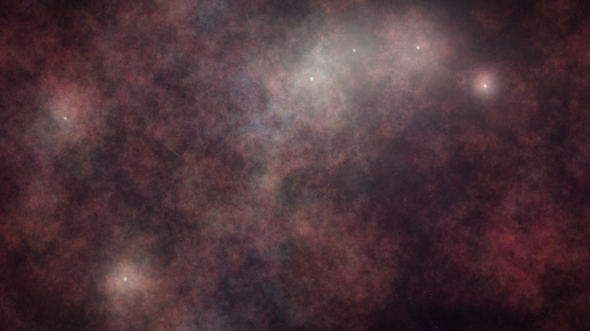

# stellar_nursery

## Metadata
- **Date**: 2026-04-26
- **Theme**: space, astronomy, star formation, emission nebula, cosmos.
- **Technique**: multi-scale fBm spectral noise for gas density, narrowband emission palette (Hα/OIII/SII), protostar glow with core+halo, dust extinction, multi-scale bloom post-processing, HDR tone mapping.
- **Logic Lab Reference**: None

## Concept
A stellar nursery rendered from first-principles astrophotography: layered fractal gas clouds in hydrogen-alpha red, oxygen-III teal, and sulfur-II amber; embedded protostars illuminate the nebula from within; dust lanes carve dark silhouettes; film grain and vignette mimic a deep-sky telescope exposure.

## Technical Details
- **Renderer**: P2D
- **Simulation**: multi-scale fBm spectral noise for gas density, narrowband emission palette (Hα/OIII/SII), protostar glow with core+halo, dust extinction, m.
- **Visuals**: HSB spectral mapping, bloom-like highlights, prismatic color, dark-field contrast.
- **Animation**: Still image
