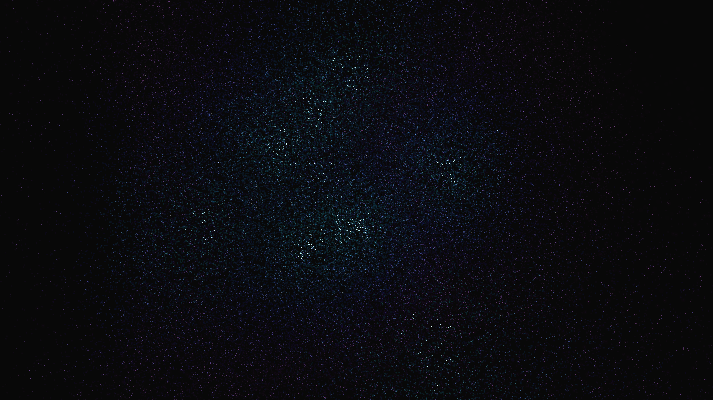

# stellar_nursery_dust

## Metadata
- **Date**: 2026-05-05
- **Theme**: Stellar nursery, gravitational collapse, protostars, beautiful night sky.
- **Technique**: 3D particle simulation (80,000 particles) using a vectorized gravity model with 12 dynamic mass centers. Features multi-layer rendering: a coarse "gas" background, medium-density "dust" clouds, and white-hot "protostar" cores. 60fps high-bitrate MP4 encoding.
- **Logic Lab Reference**: None

## Concept
A vast, swirling cosmic cloud collapsing under its own weight; deep violet dust gives way to shimmering cyan filaments, culminating in the birth of brilliant white-hot infant stars that illuminate the nebula from within.

## Technical Details
- **Renderer**: P3D
- **Simulation**: particle, 3D particle.
- **Visuals**: HSB spectral mapping, bloom-like highlights, prismatic color, dark-field contrast.
- **Animation**: 10 seconds at 60fps
