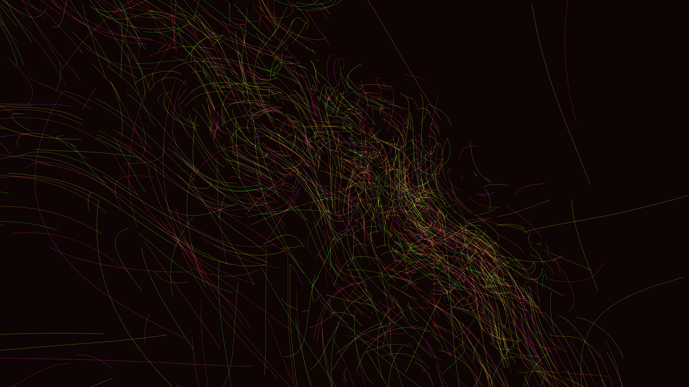

# stochastic_flow_field_ribbons_3d

## Metadata
- **Date**: 2026-05-28
- **Theme**: - **Date**: 2026-05-28 - **Theme**: A dense 3D flow field driven by Perlin noise, visualized not by 
- **Technique**: Unknown
- **Logic Lab Reference**: 

## Concept
- **Date**: 2026-05-28
- **Theme**: A dense 3D flow field driven by Perlin noise, visualized not by single particles but by sweeping ribbons or trails that continuously trace the vector field, creating volumetric abstract forms that shift over time.
- **Technique**: Create thousands of particles whose paths form continuous lines or ribbons. Instead of full physics, update paths based on 3D noise vectors and time. Render using `py5.begin_shape()` with lines and additive blending in 3D.
- **Description**: An animated 3D flow field ribbon visualization.

## Technical Details
- **Renderer**: Unknown
- **Simulation**: Unknown
- **Visuals**: Unknown
- **Animation**: Unknown
