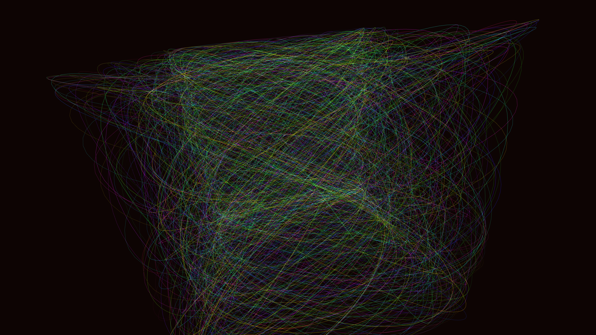

# stochastic_lissajous_web_3d

## Metadata
- **Date**: 2026-05-28
- **Theme**: - **Date**: 2026-05-28 - **Theme**: An intricate, glowing web formed by thousands of overlapping 3D 
- **Technique**: Unknown
- **Logic Lab Reference**: 

## Concept
- **Date**: 2026-05-28
- **Theme**: An intricate, glowing web formed by thousands of overlapping 3D Lissajous curves with slowly varying frequencies and phases.
- **Technique**: Parametric 3D equations driven by sine/cosine with varying phase offsets and frequency ratios. Draw curves by connecting points with translucent, additive-blended lines in P3D, slowly rotating the entire bundle.
- **Description**: An animated glowing 3D web of stochastic Lissajous curves.

## Technical Details
- **Renderer**: P3D
- **Simulation**: Unknown
- **Visuals**: Unknown
- **Animation**: Unknown
