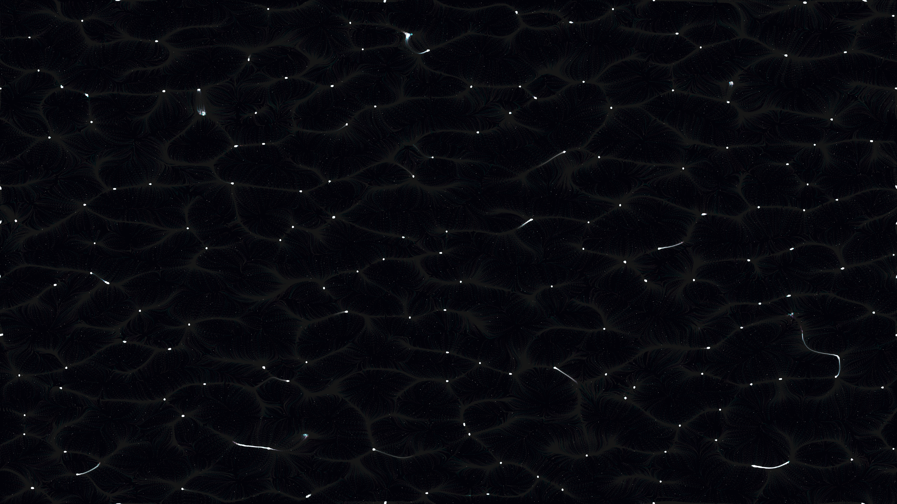

# stochastic_nebula

A generative media art piece created with py5 and NumPy, exploring the organic beauty of celestial gas clouds through stochastic Langevin dynamics.



## Artistic Concept
`stochastic_nebula` visualizes a celestial nursery where intricate filaments of light weave through a deep midnight void. The piece aims to capture the ethereal, smoky quality of nebulae, balancing the chaos of stochastic movement with the underlying structure of a noise-potential field.

## Technical Implementation
- **Langevin Dynamics**: Particles follow a velocity field derived from the gradient of a multi-scale OpenSimplex noise potential, combined with a stochastic "kick" (Brownian motion).
- **Vectorized Flow**: 90,000 particles are simulated in parallel using NumPy, ensuring high performance.
- **Optimization**: The noise field and its gradients are pre-computed on a 512x512 grid, with particles performing fast lookups based on their spatial coordinates.
- **Rendering**: Uses additive blending (`py5.ADD`) with a slow background decay (`py5.BLEND` rect with low alpha) to create persistent but non-saturating light trails.
- **Palette**: A "beautiful night sky" palette of Electric Cyan, Royal Amethyst, Rose Gold, and White-Gold.

## Requirements
- Python 3.10+
- `py5`
- `numpy`

## Usage
Run the sketch using:
```bash
uv run python main.py
```
