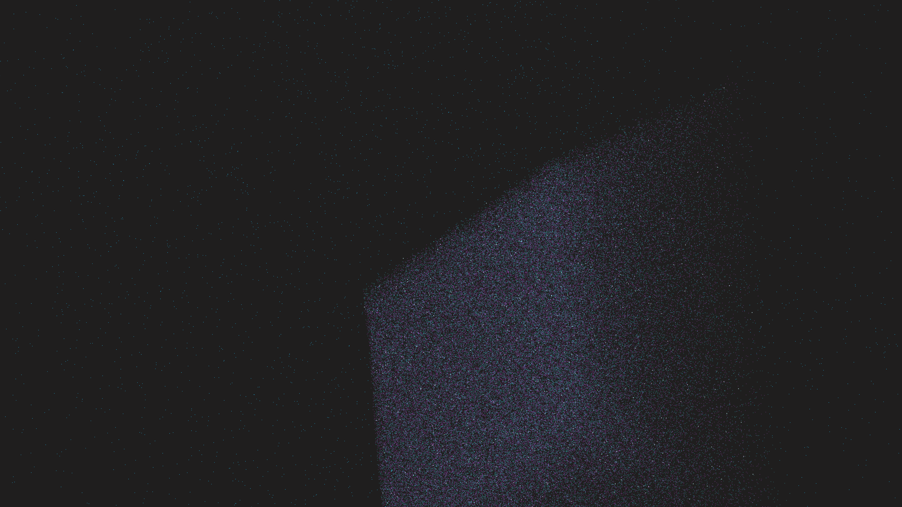

# stochastic_resonance_lattice

## Metadata
- **Date**: 2026-05-09
- **Theme**: Stochastic resonance, coupled oscillators, signal-in-noise, lattice dynamics, beautiful night sky.
- **Technique**: 3D simulation of 150,000 particles following Langevin dynamics in a double-well potential landscape ($V(x) = -x^2/2 + x^4/4$). Implements nonlinear synchronization driven by Gaussian white noise and a weak periodic forcing signal. Multi-pass additive point rendering with state-dependent coloring ("Electric Cyan / Deep Amethyst / Neon White"). 60fps high-bitrate MP4.
- **Logic Lab Reference**: None

## Concept
A majestic vision of order emerging from chaos; a shimmering cloud of electric cyan and deep amethyst light pulses with a hidden cosmic rhythm. As the collective oscillators synchronize through the mechanism of stochastic resonance, the noisy void crystallizes into a pulsing geometric lattice of neon white energy against the star-dusted indigo night.

## Technical Details
- **Renderer**: P3D
- **Simulation**: particle.
- **Visuals**: additive blending.
- **Animation**: 20 seconds at 60fps
