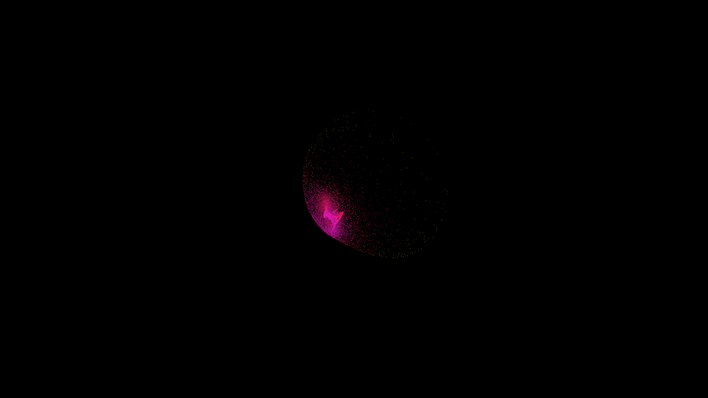

# strange_attractor_aizawa

## Metadata
- **Date**: 2026-05-23
- **Theme**: A mesmerizing 3D point cloud simulation of the Aizawa strange attractor, tracing intricate intertwin
- **Technique**: Unknown
- **Logic Lab Reference**: 

## Concept
A mesmerizing 3D point cloud simulation of the Aizawa strange attractor, tracing intricate intertwined spherical lobes.

- **Theme**: The mathematical beauty of the Aizawa strange attractor and chaotic orbits.
- **Technique**: 2.5D point cloud with 80,000 tracers using the Aizawa attractor equations. Additive blending with a shifting HSB palette of deep cyan, emerald, and gold. 15s 60fps MP4.
- **Description**: Tens of thousands of glowing particles flow from the center to map out the hypnotic, spherical shape of the Aizawa strange attractor. As they orbit, their trajectories illustrate the delicate balance between determinism and chaos, shifting in hue to create a vibrant, glowing mathematical sculpture in the void.

## Technical Details
- **Renderer**: Unknown
- **Simulation**: Unknown
- **Visuals**: Unknown
- **Animation**: Contains animation details
