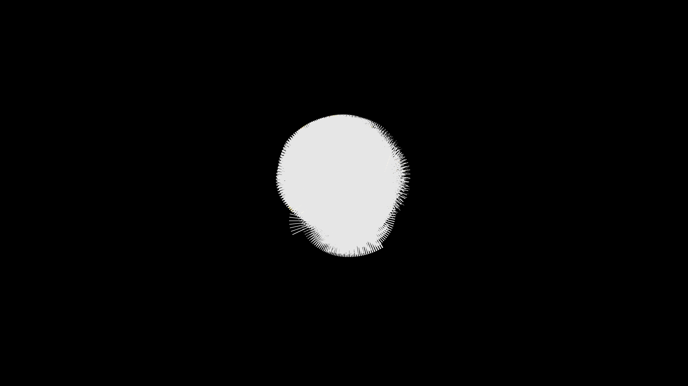

# strange_attractor_aizawa_3d

## Metadata
- **Date**: 2026-05-27
- **Theme**: - **Date**: 2026-05-27 - **Theme**: A mesmerizing and chaotic 3D orbit tracing the Aizawa strange at
- **Technique**: Unknown
- **Logic Lab Reference**: 

## Concept
- **Date**: 2026-05-27
- **Theme**: A mesmerizing and chaotic 3D orbit tracing the Aizawa strange attractor. A continuously glowing trail of thousands of particles draws a beautiful, tangled geometric butterfly-like shape.
- **Technique**: Iterative calculation of the Aizawa attractor differential equations. Particles follow the vector field, fading out to create smooth glowing trails.
- **Description**: An animated 3D strange attractor (Aizawa).

## Technical Details
- **Renderer**: Unknown
- **Simulation**: Unknown
- **Visuals**: Unknown
- **Animation**: Unknown
