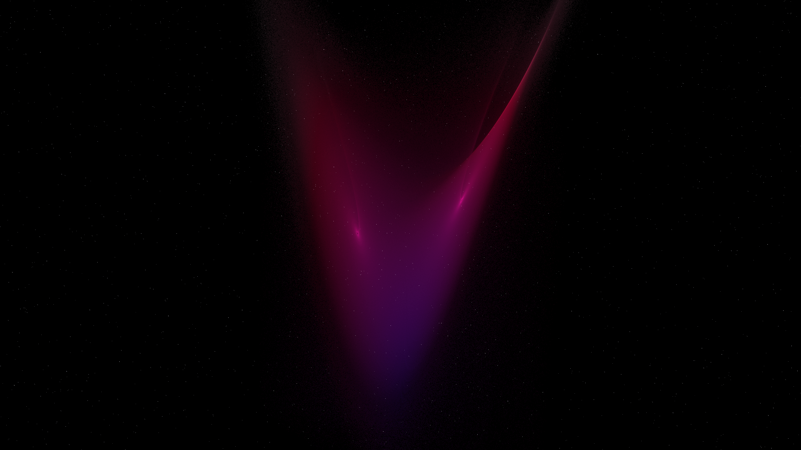

# Strange Attractor Dust

A chaotic, high-density visualization of the Lorenz Attractor as a primordial stardust nebula.

## Concept
Strange attractors are mathematical structures that represent the hidden order within chaotic systems. In this work, we simulate the movement of 120,000 particles governed by the Lorenz equations. As the particles diverge through chaotic feedback, they weave a complex, three-dimensional "dust" cloud that resembles a celestial butterfly nebula.

## Technical Details
- **Lorenz Attractor Simulation**: The particle trajectories are computed using numerical integration of the Lorenz equations (σ=10, ρ=28, β=8/3).
- **High-Density Accumulation**: 120,000 particles are simulated over 500 iterations, resulting in a dataset of millions of spatial points.
- **Histogram-Based Rendering**: To handle the massive point count, the points are projected into a 2D histogram buffer. This allows for smooth density accumulation and a "silken" visual texture.
- **Gamma-Corrected Mapping**: A power-law mapping (γ=0.3) is applied to the density field to reveal the delicate, faint structures of the attractor's lobes.
- **Spectral Color Mapping**: Colors are mapped based on the 3D radius of the particles, transitioning from deep electric violet to crimson and soft supernova white.

## Aesthetics
- **Palette**: Obsidian Void, Electric Violet, Crimson Flare, Supernova White.
- **Mood**: Chaotic, intense, and ordered.
- **Visuals**: A luminous, silky vortex with two glowing focal centers, surrounded by a fine mist of celestial dust.
