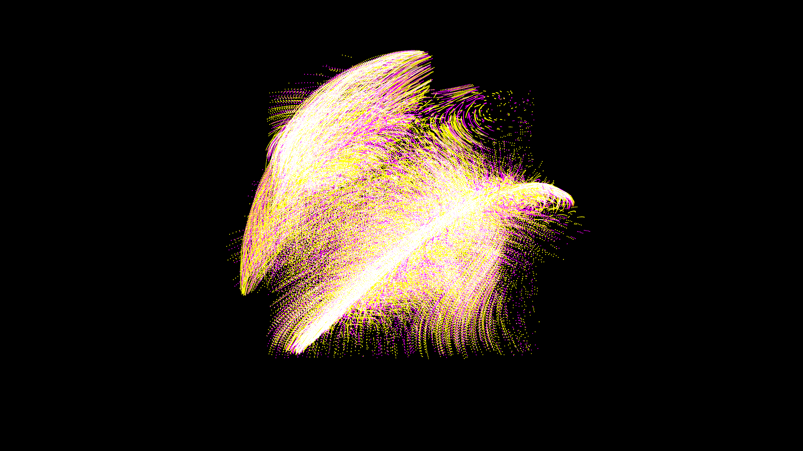

# strange_attractor_manifold

## Metadata
- **Date**: 2026-05-10
- **Theme**: Chaos theory, strange attractors (Lorenz, Rössler, Thomas), topological manifolds, deterministic chaos, dynamic systems.
- **Technique**: A 3D particle simulation where thousands of points are released into a vector field defined by a system of non-linear differential equations (e.g., a parameterized Lorenz or Thomas' cyclically symmetric attractor). Over time, the parameters of the equations slowly drift, morphing the topology of the attractor manifold in real-time. Rendered with py5 P3D, additive blending, and motion trails.
- **Logic Lab Reference**: None

## Concept
A dense cluster of intensely glowing orange and fuchsia particles rapidly expands, constrained by invisible mathematical currents, tracing out a glowing, continuously morphing butterfly-like or knotted topological manifold.

## Technical Details
- **Renderer**: P3D
- **Simulation**: particle, 3D particle.
- **Visuals**: additive blending, persistent trails, bloom-like highlights, dark-field contrast.
- **Animation**: 15 seconds at 60fps
